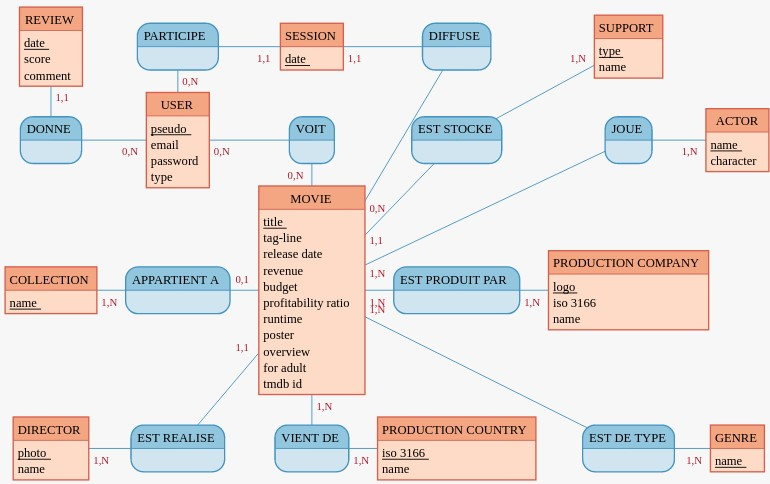

## CONCEPTION BDD

    

        <strong>User cases</strong>
    

En tant que...|Je veux pouvoir..|Afin de...|Version
|-|-|-|-|
VISITEUR|Accéder à la page **ACCUEIL** *(bannière)*|présentation|1.0|
VISITEUR|Accéder à la page **LES VIDÉOS** *(BURGER menu)*|voir la liste des vidéos sous forme de vignette (vignette principale)|1.0|
VISITEUR|Accéder à la page **RECHERCHE** *(BURGER menu)*|trouver rapidement un film à partir de différents critères de recherche|1.0|
VISITEUR|Accéder au **FORMULAIRE DE CONTACT** *(menu CONTACT)*|Envoyer un mail aux admins|1.0|
VISITEUR|Accéder au **FORMULAIRE D’INSCRIPTION** *(menu USER)*|s’inscrire|1.0|
VISITEUR|Accéder à la page **LA VIDÉO DU MOMENT** *(BURGER menu)*|voir la vignette détaillée d’un film|1.0|
UTILISATEUR|Accéder à la page **ACCUEIL** *(bannière)*|présentation|1.0
UTILISATEUR|Accéder à la page **LES VIDÉOS** *(BURGER menu)*|voir la liste des vidéos sous forme de vignette (vignette principale + vignette détails)|1.1
UTILISATEUR|Accéder à la page **RECHERCHE** *(BURGER menu)*|trouver rapidement un film à partir de différents critères de recherche (ajout du critère support)|1.1|
UTILISATEUR|Accéder au **FORMULAIRE DE CONTACT** *(menu CONTACT)*|Envoyer un mail aux admins|1.0|UTILISATEUR|Accéder au **FORMULAIRE DE CONNEXION** *(menu USER)*|se connecter|1.1|
UTILISATEUR|Accéder à la page **MES FAVORIS** *(BURGER menu)*|voir la liste de mes films favoris|1.1|
UTILISATEUR|Accéder à la page **LA VIDÉO DU MOMENT** *(BURGER menu)*|voir la vignette détaillée d’un film|1.0|
UTILISATEUR|Accéder à la page **MES PROPOSITIONS** *(BURGER menu)*|voir les films qui me sont proposés par rapport à mes goûts ou en général|1.1|
UTILISATEUR|Accéder à la page **MES SÉANCES** *(BURGER menu)*|Voir la liste de mes séances|1.1|
UTILISATEUR|Accéder à la page **MES AVIS** *(BURGER menu)*|Voir la liste de mes avis|1.1|
UTILISATEUR|Accéder à la page **MON PROFIL** *(menu USER)*|Modifier / Supprimer mon profil utilisateur|1.1|ADMINISTRATEUR|Accéder à la page **ACCUEIL** *(bannière)*|présentation|1.0|
ADMINISTRATEUR|Accéder à la page **LES VIDÉOS** *(BURGER menu)*|voir la liste des vidéos sous forme de vignette (vignette princi|pale + vignette détails)|1.1|
ADMINISTRATEUR|Accéder à la page **RECHERCHE** *(BURGER menu)*|trouver rapidement un film à partir de différents critères de recherche (ajout du critère support)|1.1|
ADMINISTRATEUR|Accéder au **FORMULAIRE DE CONTACT** *(menu CONTACT)*|Envoyer un mail aux admins|1.0|
ADMINISTRATEUR|Accéder au **FORMULAIRE DE CONNEXION** *(menu USER)*|se connecter|1.1|
ADMINISTRATEUR|Accéder à la page **MES FAVORIS** *(BURGER menu)*|voir la liste de mes films favoris|1.1|
ADMINISTRATEUR|Accéder à la page **LA VIDÉO DU MOMENT** *(BURGER menu)*|voir la vignette détaillée d’un film|1.1|
ADMINISTRATEUR|Accéder à la page **MES PROPOSITIONS** *(BURGER menu)*|voir les films qui me sont proposés par rapport à mes goûts ou en général|1.1|
ADMINISTRATEUR|Accéder à la page **MES SÉANCES** *(BURGER menu)*|Voir la liste de mes séances|1.1|
ADMINISTRATEUR|Accéder à la page **MES AVIS** *(BURGER menu)*|Voir la liste de mes avis|1.1|
ADMINISTRATEUR|Accéder à la page **AJOUT ADMIN** *(menu USER)*|Ajouter un nouvel admin|1.2|
ADMINISTRATEUR|Accéder à la page **MON PROFIL** *(menu USER)*|Modifier / Supprimer mon profil utilisateur|1.1|
ADMINISTRATEUR|Accéder à la page **AJOUT FILM** *(BURGER menu)*|Ajouter un film|1.2|
ADMINISTRATEUR|Accéder à la page **SUPPORT** *(BURGER menu)*|Gérer les supports (ajout, modif, suppression)|1.2|
ADMINISTRATEUR|Accéder à la page **MODIFIER FILM** *(BURGER menu)*|changer le support d’un film|1.2|
ADMINISTRATEUR|Accéder à la page **VALIDER UN AVIS** *(BURGER menu)*|Valider / Refuser un avis|1.2|
ADMINISTRATEUR|Accéder à la page **SUPPRIMER UN COMPTE UTILISATEUR** *(BURGER menu)*|supprimer un compte utilisateur|1.2|
ADMINISTRATEUR|Accéder à la page **STATS** *(BURGER menu)*|voir différentes stats|1.2|

    

        <strong>Dictionnaire des données</strong>
    

### Entités :

-  **USER**
  
Nom|Description|Type|Commentaire|Contraintes|
-|-|-|-|-|
id|PK|INT|Clé primaire|UNIQUE, NOT NULL|
pseudo|pseudo|TEXT|-|UNIQUE, NOT NULL|
email|adresse mail|TEXT|Vérifier la validité de l’adresse|NOT NULL|
password|mot de passe|password|création d’un type|NOT NULL|
type|type d’utilisateur|TEXT|user ou admin|NOT NULL, DEFAULT user|
updated_at|date de mise à jour|TIMESTAMPTZ|la création n’est pas une mise à jour|-|
created_at|date de création|TIMESTAMPTZ|-|NOT NULL|

-  **MOVIE**
  
Nom|Description|Type|Commentaire|Contraintes|
-|-|-|-|-|
id|PK|INT|Clé primaire|UNIQUE, NOT NULL|
title|titre|TEXT|-|NOT NULL|
tag-line|sous-titre|TEXT|-|-|
release_date|date de réalisation|DATE|-|-|
revenue|revenus générés|INT|en $|-|
budget|budget|INT|en $|-|
profitability_ratio|ratio de rentabilité (revenus/budget)|NUMBER|exprimé en %|-|
runtime|durée|INT|en min|-|
poster|affiche|TEXT|-|-|
overview|synopsis|TEXT|en français|-|
for_adult|pour adulte|BOOLEAN|-|-|
support_id|support|INT|Foreign Key|NOT NULL|
director_id|réalisateur|INT|Foreign Key|NOT NULL|
collection_id|collection|INT|Foreign Key|NOT NULL|
tmdb_id|id TMDB pour retrouver le détail grâce à l’API de TMDB|INT|pour retrouver le détail d’un contenu grâce à l’API de TMDB|NOT NULL|
updated_at|date de mise à jour|TIMESTAMPTZ|la création n’est pas une mise à jour|-|
created_at|date de création|TIMESTAMPTZ|-|NOT NULL|

-  **SESSION**
  
Nom|Description|Type|Commentaire|Contraintes|
-|-|-|-|-|
id|PK|INT|Clé primaire|UNIQUE, NOT NULL|
date|date de la séance|DATE|-|NOT NULL|
user_id|id de l’utilisateur qui a choisi le contenu|INT|Foreign Key|NOT NULL|
movie_id|id du film|INT|Foreign Key|NOT NULL|
updated_at|date de mise à jour|TIMESTAMPTZ|la création n’est pas une mise à jour|-|
created_at|date de création|TIMESTAMPTZ|-|NOT NULL|

-  **SUPPORT**
  
Nom|Description|Type|Commentaire|Contraintes|
-|-|-|-|-|
id|PK|INT|Clé primaire|UNIQUE, NOT NULL|
type|type de support|
TEXT|(CD - DD - USB - DVD)|NOT NULL|
name|nom du support|TEXT|-|NOT NULL|
updated_at|date de mise à jour|TIMESTAMPTZ|la création n’est pas une mise à jour|-|
created_at|date de création|TIMESTAMPTZ|-|NOT NULL|

-  **REVIEW**
  
Nom|Description|Type|Commentaire|Contraintes|
-|-|-|-|-|
id|PK|INT|Clé primaire|UNIQUE, NOT NULL|
user_id|id de l’utilisateur qui a rédigé l’avis|INT|Foreign Key|NOT NULL|
date|Date de rédaction de l’avis|DATE|-|NOT NULL|
score|Note du contenu|INT|de 0 à 5 par pas de 0.5|NOT NULL|
comment|Commentaire|TEXT|-|NULLABLE|
movie_id|id du film|INT|Foreign Key|NOT NULL|
session_id|id de la session|INT|Foreign Key|NOT NULL|
updated_at|date de mise à jour|TIMESTAMPTZ|la création n’est pas une mise à jour|-|
created_at|date de création|TIMESTAMPTZ|-|NOT NULL|

-  **GENRE**
  
Nom|Description|Type|Commentaire|Contraintes|
-|-|-|-|-|
id|PK|INT|Clé primaire|UNIQUE, NOT NULL|
name|nom du genre|TEXT|-|NOT NULL|
updated_at|date de mise à jour|TIMESTAMPTZ|la création n’est pas une mise à jour|-|
created_at|date de création|TIMESTAMPTZ|-|NOT NULL|

-  **COLLECTION**
  
Nom|Description|Type|Commentaire|Contraintes|
-|-|-|-|-|
id|PK|INT|Clé primaire|UNIQUE, NOT NULL|
name|nom du genre|TEXT|-|NOT NULL|
updated_at|date de mise à jour|TIMESTAMPTZ|la création n’est pas une mise à jour|-|
created_at|date de création|TIMESTAMPTZ|-|NOT NULL|

-  **PRODUCTION_COMPANY**
  
Nom|Description|Type|Commentaire|Contraintes|
-|-|-|-|-|
id|PK|INT|Clé primaire|UNIQUE, NOT NULL|
logo|chemin du logo|TEXT|-|-|
iso_3166|code ISO du pays|TEXT|2 caractères (US - FR ...) permet d’obtenir le drapeau|NOT NULL|
name|nom de la société de production|TEXT|-|NOT NULL|
updated_at|date de mise à jour|TIMESTAMPTZ|la création n’est pas une mise à jour|-|
created_at|date de création|TIMESTAMPTZ|-|NOT NULL|

-  **PRODUCTION_COUNTRY**
  
Nom|Description|Type|Commentaire|Contraintes|
-|-|-|-|-|
id|PK|INT|Clé primaire|UNIQUE, NOT NULL|
iso_3166|code ISO du pays|TEXT|2 caractères (US - FR ...) permet d’obtenir le drapeau|NOT NULL|
name|nom du pays de production|TEXT|-|NOT NULL|
updated_at|date de mise à jour|TIMESTAMPTZ|la création n’est pas une mise à jour|-|
created_at|date de création|TIMESTAMPTZ|-|NOT NULL|

-  **ACTOR**
  
Nom|Description|Type|Commentaire|Contraintes|
-|-|-|-|-|
id|PK|INT|Clé primaire|UNIQUE, NOT NULL|
name|nom de l‘acteur|TEXT|-|NOT NULL|
character|nom du personnage|TEXT|-|NOT NULL|
updated_at|date de mise à jour|TIMESTAMPTZ|la création n’est pas une mise à jour|-|
created_at|date de création|TIMESTAMPTZ|-|NOT NULL|

-  **DIRECTOR**
  
Nom|Description|Type|Commentaire|Contraintes|
-|-|-|-|-|
id|PK|INT|Clé primaire|UNIQUE, NOT NULL|
photo|photo du réalisateur|TEXT|-|-|
name|nom du réalisateur|TEXT|-|NOT NULL|
updated_at|date de mise à jour|TIMESTAMPTZ|la création n’est pas une mise à jour|-|
created_at|date de création|TIMESTAMPTZ|-|NOT NULL|

-  **FAVORITE**
  
Nom|Description|Type|Commentaire|Contraintes|
-|-|-|-|-|
id|PK|INT|Clé primaire|UNIQUE, NOT NULL|
user_id|id de l’utilisateur|INT|Foreign key|NOT NULL|
movie_id|id du film|INT|Foreign key|NOT NULL|
updated_at|date de mise à jour|TIMESTAMPTZ|la création n’est pas une mise à jour|-|
created_at|date de création|TIMESTAMPTZ|-|NOT NULL|

-  **VOIR**
  
Nom|Description|Type|Commentaire|Contraintes|
-|-|-|-|-|
id|PK|INT|Clé primaire|UNIQUE, NOT NULL|
user_id|id de l’utilisateur|INT|-|NOT NULL|
movie_id|id du film|INT|-|NOT NULL|
updated_at|date de mise à jour|TIMESTAMPTZ|la création n’est pas une mise à jour|-|
created_at|date de création|TIMESTAMPTZ|-|NOT NULL|

-  **JOUER**
  
Nom|Description|Type|Commentaire|Contraintes|
-|-|-|-|-|
id|PK|INT|Clé primaire|UNIQUE, NOT NULL|
actor_id|id de l’acteur|INT|-|NOT NULL|
movie_id|id du film|INT|-|NOT NULL|
updated_at|date de mise à jour|TIMESTAMPTZ|la création n’est pas une mise à jour|-|
created_at|date de création|TIMESTAMPTZ|-|NOT NULL|

-  **PRODUCTION**
  
Nom|Description|Type|Commentaire|Contraintes|
-|-|-|-|-|
id|PK|INT|Clé primaire|UNIQUE, NOT NULL|
production_company_id|id de la société de production|INT|-|NOT NULL|
movie_id|id du film|INT|-|NOT NULL|
updated_at|date de mise à jour|TIMESTAMPTZ|la création n’est pas une mise à jour|-|
created_at|date de création|TIMESTAMPTZ|-|NOT NULL|

-  **TYPE**
  
Nom|Description|Type|Commentaire|Contraintes|
-|-|-|-|-|
id|PK|INT|Clé primaire|UNIQUE, NOT NULL|
genre_id|id du genre|INT|-|NOT NULL|
movie_id|id du film|INT|-|NOT NULL|
updated_at|date de mise à jour|TIMESTAMPTZ|la création n’est pas une mise à jour|-|
created_at|date de création|TIMESTAMPTZ|-|NOT NULL|

-  **ORIGINE**
  
Nom|Description|Type|Commentaire|Contraintes|
-|-|-|-|-|
id|PK|INT|Clé primaire|UNIQUE, NOT NULL|
production_country_id|id du pays de production|INT|-|NOT NULL|
movie_id|id du film|INT|-|NOT NULL|
updated_at|date de mise à jour|TIMESTAMPTZ|la création n’est pas une mise à jour|-|
created_at|date de création|TIMESTAMPTZ|-|NOT NULL|

<strong>MCD</strong>

REVIEW: date, score, comment
PARTICIPE, 11 SESSION, 0N USER
SESSION: date
DIFFUSE, 0N MOVIE, 11 SESSION
SUPPORT: type, name
:

DONNE, 11 REVIEW, 0N USER
USER: pseudo, email, password, type
VOIT, 0N MOVIE, 0N USER
EST STOCKE, 1N SUPPORT, 11 MOVIE
JOUE, 1N MOVIE, 1N ACTOR
ACTOR: name, character

COLLECTION: name
APPARTIENT A, 1N COLLECTION, 01 MOVIE
MOVIE: title, tag-line, release date, revenue, budget,profitability ratio, runtime, poster, overview, for adult, tmdb id
EST PRODUIT PAR , 1N PRODUCTION COMPANY, 1N MOVIE
PRODUCTION COMPANY: logo, iso 3166, name
:

DIRECTOR: photo, name
EST REALISE, 1N DIRECTOR, 11 MOVIE
VIENT DE , 1N PRODUCTION COUNTRY, 1N MOVIE
PRODUCTION COUNTRY: iso 3166, name
EST DE TYPE, 1N GENRE, 1N MOVIE
GENRE: name

<strong>MLD</strong>

- USER (pseudo, email, password, type)
- MOVIE (title, tag-line, release_date, revenue, budget, profitability ratio, runtime, poster, overview, for adult, tmdb_id, #support_id, #director_id, #collection_id)
- SESSION (date, #user_id, #movie_id) 
- REVIEW (date, score, comment, #user_id, #movie_id)
- SUPPORT (type, name)
- GENRE (name)
- COLLECTION (name)
- PRODUCTION_COMPANY (logo, iso_3166, name)
- PRODUCTION_COUNTRY (iso_3166, name)
- ACTOR (name, character)
- DIRECTOR (photo, name)
- VOIR (#user_id, #movie_id)
- JOUER (#actor_id, #movie_id)
- PRODUCTION (#movie_id, #production_company_id)
- TYPE (#movie_id, #genre_id)
- ORIGINE (#movie_id, #production_country)

    

        <strong>Liste des routes</strong>
    

    
### V1.0

- **FRONT**
  
Num|URL|Description|
|-|-|-|
1|/|page d'accueil|
2|/videos|page listant les vidéos|
3|/search|page de recherche|
4|/close-up|page “la vidéo du moment”|
5|/contact|formulaire de contact|
6|/sign-up|formulaire d’inscription|

- **BACK**
  
Méthode HTTP|URL|Contrôleur|Description|
|-|-|-|-|
POST|/api/videos|videosController (*allVideosVisitor*)|Retourne toutes les vidéos (*MOVIE*)|
POST|/api/sign_up|userController (*signUp*)|Ajout d’ un user (*USER*)|
GET|/api/search|searchController (*searchVideosVisitor*)|Retourne les résultats de recherche|
GET|/api/close-up|videostController (*closeUp*)|Retourne les infos d’un vidéo au hasard|
GET|/api/contact|contactController (*SendMessage*)|Envoi un message|

