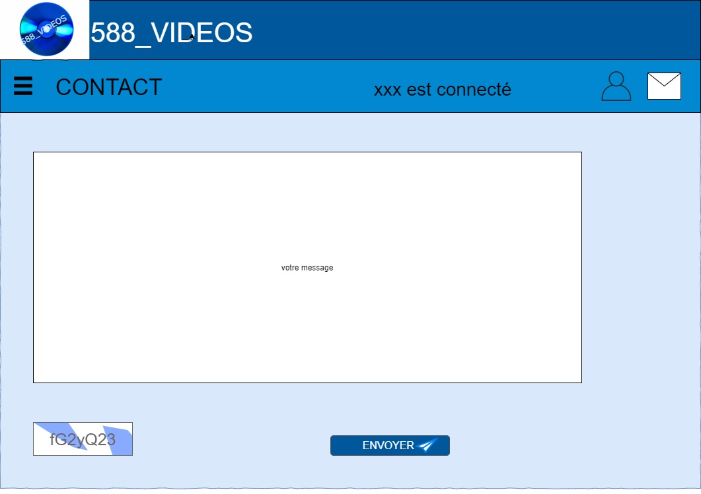

# cahier des charges fonctionnel

    

        <strong>Présentation du projet</strong>
    

588_videos est le gestionnaire de ma vidéothèque perso.
Le but du projet est avant-tout de pratiquer et d’acquérir de nouvelles compétences.
Je vais travailler sur :

- L'inscription / connexion d'un utilisateur.
- Différents niveaux de droits utilisateurs (utilisateurs et admin)
- La modération des notes données aux films.
- La multiplication volontaire de tables afin de pratiquer un peu de SQL au détriment de l'optimisation.
- Faire un travail propre de A à Z en termes d'organisation et de contenus.

    

        <strong>Objectifs du projet</strong>
    

588_videos devra me permettre de:

- vérifier si j’ai déjà vu un film.
- retrouver un film “physiquement”.
- retrouver un film en fonction de différents critères (sociétés de production, acteur, budget, genre, durée, notation ….)
- proposer une liste de film en fonction des précédents choix de l’utilisateur.
- noter un film.
- créer des séances de visionnage. 

    

        <strong>MVP (Minimum Viable Project) </strong>
    

**Version 1.0**
---------------
Profil **visiteur**:

- Liste complète des vidéos (pas d’accès aux détails).
- Recherche par titre, année genre, Pour adulte, acteurs, budget, sociétés de production….
- Formulaire de contact
- Formulaire d’inscription
- 1 proposition au hasard avec détails

**Version 1.1**
--------------
Profil **utilisateur** :

- Connecter
- ajouter un film à ses favoris
- faire une recherche par type de support
- créer une séance de visionnage
- voir les détails d’un film
- déposer un avis
- voir la liste des séances de l’utilisateur connecté et supprimer une séance (nombre de séance, séance sans avis)
- voir la liste de ses avis et modification + état de l’avis (en attente, validé, refusé)
- modifier de son profil utilisateur
- avoir des propositions en fonction des avis

**Version 1.2**
-----------------
Profil **admin** :

- créer un admin
- ajouter un film
- modifier un film
- valider un avis
- supprimer un compte utilisateur
- avoir accès à des stats:
  - film le plus vus
  - user qui a vu le plus de film
  - user qui donne le plus d’avis
  - nb d’avis
  - nb d’utilisateur

    

        <strong>Description des fonctionnalités</strong>
    

**Version 1.0**
------------
- Liste complète des vidéos (pas d’accès aux détails).
- Afficher une vignette pour chaque film de la base de données.(1 ou 2 vignettes en X, scroll en Y)
- Cette vignette comprendra :
    - Affiche
    - titre
    - sous titre
    - année
    - début du synopsis
  
	Ces infos sont obtenues via l’API TMdb

- Recherche par titre, année, genre, Pour adulte, acteurs, budget, sociétés de production….
    Un select permettra de choisir le critère de recherche (titre (par défaut), année, genre, Pour adulte, acteurs, budget (fourchette), coeff de rentabilité (gain/budget), sociétés de prod.
    Pour genre et sociétés de prod, la barre de recherche sera remplacée par un second select comprenant la liste présente en bdd.
    
    **Résultats de la recherche :** 

    - Rappel du critère de recherche.
    - Possibilité de faire une autre recherche sur la liste complète ou sur les résultats.(toggle)
    - Indiquer le nombre de résultat
    - Affichage identique à la liste complète (vignettes)

- Formulaire de contact :
    - possibilité d’envoyer un mail (captcha)
  
- Formulaire d’inscription:
  - pseudo
  - e-mail
  - mot de passe
  - confirmation du mot de passe
  - Je souhaite recevoir un mail qui m’alerte à chaque connexion sur mon compte

- Proposition au hasard:
  Depuis menu burger : Le film du moment
    Vue détaillée d’un film au hasard :
	- idem vignette principale +
    	- synopsis en entier
      	- durée
    	- genre
    	- budget
    	- coeff de rentabilité
    	- acteurs
    	- pays de prod(react-world-flag) pour les drapeaux
    	- société de prod
    	- collection
    	- bande annonce ?

**Version 1.1**
-----------

- Connecter
  
    formulaire :
    - pseudo
    - mot de passe
    
    à la connexion un mail est envoyé à l’utilisateur pour l’informer des connexions sur son compte.+ un mail de réponse si jamais ce n’est pas lui qui s’est connecté.

- ajouter un film à ses favoris
  
    Dans la vignette de présentation des films, ajouter un icône favori.(coeur ?)
    le film apparaît alors dans la liste des favoris de l’utilisateur

- faire une recherche par type de support
  
    Ajouter un nouveau critère de recherche: type de support (cd/usb/ DVD)

- créer une séance de visionnage

    Dans la vignette de présentation des films, ajouter un lien pour créer une séance.
    L’ajout d’une séance sera aussi dispo depuis la page Mes séances et la liste des favoris
    - Formulaire ajout de séance :
        - film (pré rempli si accès depuis la vignette ou liste des favoris)
        - date de la séance
        - Message de confirmation avec la durée du film
voir les détails d’un film
accessible depuis un lien sur la vue générale d’un film.
idem proposition au hasard

- déposer un avis
    depuis la liste des séances, quand la date est passée, possibilité de laisser un avis sur la séance ou depuis le menu avis
    - Formulaire d’avis : 
        - select film (pré rempli si accès depuis séance)
        - commentaire
        - note sur 5 (pas de 0.5)
		L’avis apparaîtra ensuite dans la page de validation des avis des admin.
		Il sera noté comme en attente de validation dans la liste des avis et la liste des séances. Après validation il apparaîtra comme accepté ou refusé (et effacé dans ce cas mais avec une alerte pour prévenir de la suppression + envoi d’un mail au pseudo).
- voir la liste des séances de l’utilisateur connecté et supprimer une séance
    depuis “Mes séances”, accès à la liste des séances.

    La liste reprend les infos :
    
    - titre
    - date
    - avis en attente. avis refusé. avis accepté. pas d’avis
    - accès aux avis ou au formulaire d’avis.
    - Tri par titre ou date par état des avis.
    - Barre de recherche par titre ou date, état de l’avis
    - Faire apparaître nombre de séance et séance sans avis
    voir la liste de ses avis et modification + état de l’avis (en attente, validé, refusé)
    depuis “Mes avis”
    affiche le nombre d’avis par état.

    Pour chaque avis :
    - titre
    - date
    - état de l’avis
    - modification de l’avis (pour les avis acceptés ou refusés): repasser l’avis en validation
  
- modifier de son profil utilisateur

    depuis “mon profil”, possibilité de :

    - modifier:
      - pseudo :
          - Envoi d’un mail à l’adresse mail pour validation: lien cliquable :
          - affiche pseudo modifié
          - fait la modif en base de données
      - email:
          - Envoi d’un mail à la nouvelle adresse mail pour validation : lien cliquable :
            - affiche le mail a été modifié
            - fait la modif en base de données
      - mot de passe:
          - Envoi d’un mail à la nouvelle adresse mail pour validation : lien cliquable :
            - affiche le mot de passe a été modifié
            - fait la modif en base de données

    - supprimer mon compte:
      - Envoi d’un mail pour confirmation lien :
      - affiche compte supprimé
      - suppression en bdd

- avoir des propositions en fonction des avis:
  - Depuis “mes propositions”, lister les films selon différents critères:
  - Lister des films non vus uniquement.

    - **Propositions par rapport aux séances, avis de l’utilisateur**:
      - genre:
        - films dont le genre à la meilleure note donnée.
        - films dont le genre à le plus de séance
      - collection:
        - lister les films non vus d’une même collection
      - Réalisateur:
        - lister les films du réalisateur qui a la meilleure note
        - lister les films du réalisateur qui a le plus de vues.
      - Société de production:
        - lister les films de la société de prod qui a la meilleure note
        - lister les films de la société de prod qui a le plus de vues.

	- **Propositions par rapport aux autres utilisateurs**:
        - film le + ou le - vu.
        - film qui a la meilleure ou la pire note
        - film le + ou le - rentable

**Version 1.2**
---------------

- créer un admin
  
    Depuis menu user, possibilité d’ajouter un administrateur (idem création d’user)
- ajouter un film
  
    Depuis menu admin, possibilité d’ajouter un film. La recherche se fait par titre. Une vignette détail apparaît pour chaque résultat  avec possibilité d’ajouter le film + un tag qui alerte si le film existe déjà dans la base. 
- modifier un film
  
    Possibilité de modifier uniquement la localisation (support).
- recherche par titre.
  
    Faire apparaître la vignette de détail avec le support et la possibilité de le changer.
- Prévoir un menu support pour:
    - ajouter:
        - formulaire avec le nom du nouveau support. Vérifier si le support est déjà existant (alerter si déjà existant)
    - modifier:
        - Liste des supports existants. choisir le support à modifier, renseigner le nouveau nom du support.
        - modifier en bdd l’ancien nom par le nouveau nom
    - supprimer un support:
        - Demander si les films sont à transférer ou à supprimer ?
            - si transfert: afficher les films sur le support et demander sur quel est le nouveau support
            - Si suppression: supprimer les films qui avaient ce support.
- valider un avis
    depuis menu admin:
    - avis à valider
    - lister tous les avis déposés: détails de l’avis
    - possibilité d’accepter ou de refuser l’avis. Si l’avis est refusé, envoyer un mail à l’auteur avec raison du refus.

    - supprimer un compte utilisateur
        depuis menu admin, voir tous les utilisateurs avec nombre de séance, nombre d’avis refusé, nombre d’avis, nombre d'utilisateurs.

- avoir accès à des stats:
    - film le plus vus
    - film avec meilleur note
    - film qui a le plus d’avis.

    

        <strong>Les technologies</strong>
    

**FRONT**:
- HTML
- CSS
- REACT
- REDUX

**BACK**:
- NODEJS
- EXPRESS
- POSTGRESQL
- SQITCH
  
Une V2 du site est envisagée avec l’utilisation de MongoDB.

Les outils utilisés pour les tests unitaires et la documentation restent à définir.

    

        <strong>Potentielles évolutions</strong>
    

**V2**:
**MongoDB** remplacera **PostgreSQL** (passage de SQL à NoSQL)

**V3**:
Possibilité de créer sa propre BDD (élargir le public visé)

    

        <strong>Arborescence du site</strong>
    

    

        <strong>Wireframes</strong>
    

**V1.0**

- Page ACCUEIL
  

- Page LES VIDEOS
  

- Page RECHERCHE
  

- Page LA PROPOSITION DU MOMENT
  

- BURGER MENU
  

- USER MENU
  

- Formulaire de CONTACT
  

- Formulaire d'inscription
  

------
## <a href="./conception_database.md">CONCEPTION BDD</a>
